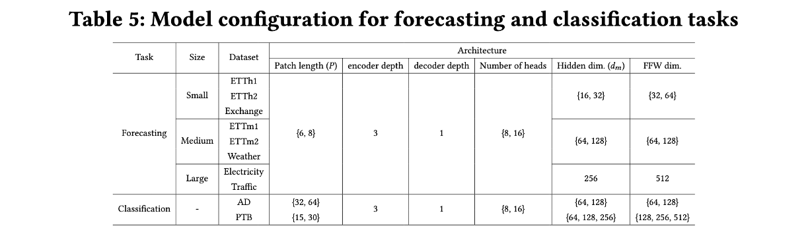
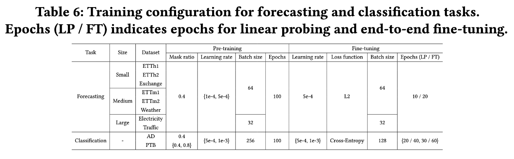

# ShuffleMTM

### This repository provides the official implementation of ShuffleMTM: Learning Cross-Channel Dependence in Channel-Independent Time Series Masked Pre-training.

# Requirements

- Python 3.9.0
- torch==2.0.1
- numpy==1.24.3
- pandas==1.5.3
- scikit-learn==1.2.2
- matplotlib==3.7.1
- tensorboardX==2.6.2.2

Dependencies can be installed using the following command:

    pip install -r requirements.txt

# Getting Started

## 1. Prepare Data

All benchmark datasets can be obtained from [Google Drive](), and arrange the folder as:

    ShuffleMTM/
    |-- datasets/
        |-- ETTh1.csv
        |-- ETTh2.csv
        |-- ETTm1.csv
        |-- ETTm2.csv
        |-- Weather.csv
        |-- Electricity.csv
        |-- exchange_rate.csv
        |-- Traffic.csv

## 2. Experimental reproduction

- We provide the scripts for pre-training and finetuning for each dataset with the best hyper-parameters in our experiment at `./scripts/`.

### Pre-training and fine-tuning at once

To implement pre-training and fine-tuning sequentially, the scripts in `./scripts/`. For example, to perform both steps at once for the ETTh1 dataset:

    bash scripts/etth1.sh
    
- If the paper is accepted, I will release the scripts for the other datasets along with the best-performing hyperparameters.
- To maintain anonymity for double-blind review, the dataset download link is not provided at this time. It will be shared upon paper acceptance.

# Model and training configurations

Depending on the task and the size of the datasets (i.e., small, medium, and large), we navigated model hyperparameters on patch length and Transformer encoder and determined the best configuration on a validation dataset. The candidate sets of model hyperparameters are summarized in Table 5.

In pre-training, we set the pre-training epochs to 100 and search for the pre-training learning rate and mask ratio for each task. During fine-tuning, we adopt the freeze-and-fine-tune strategy. In this strategy, we apply linear probing for $n$ epochs to update the downstream head while keeping the backbone frozen. Subsequently, we perform full fine-tuning of the entire network for $2n$ epochs. For the classification, we aggregate patch representations by max-pooling over patches in each channel to generate the global representation of the sample. The candidate sets of training hyperparameters are summarized in Table 6.

# Additional experiments

## 1. Ablation of the shuffling operation

We validate the effectiveness of masked series shuffling on the PEMS08 dataset, which contains 170 channels and is known known to exhibit strong spatial dependencies [1]. Due to the page limit, we provide this ablation study in the Github.
Table 6 presents the comparison results on this dataset. ShuffleMTM outperforms its counterpart without the shuffling operation, confirming again the validity of the shuffling mechanism in modeling cross-channel dependencies. This corresponds to the ablation study on the synthetic datasets (Section 5.1.1), which demonstrates the effectiveness of the shuffling mechanism on two datasets exhibiting clear and complex cross-channel dependencies.

| Pred_len | ShuffleMTM |  | ShuffleMTM | w/o Shuffle|
|:----------:|:-------------:|:-------------:|:---------:|:---------:|
||MSE|MAE|MSE|MAE|
| 96       | **0.380**       | **0.418**       | 0.383   | 0.421   |
| 192      | **0.438**       | **0.446**       | 0.442   | 0.449   | 
| 336      | **0.394**      | **0.407**       | 0.397   | 0.409   | 
| 720      | **0.465**       | **0.459**       | 0.468   | 0.461   |

Table 6) Ablations of the shuffling operation on the PEMS08 dataset

[1] BasicTS+, Z, Shao et al., TKDE 2024

## 2. Comparison with BTSF

We investigated self-supervised learning approaches designed to capture cross-channel dependencies and compared with BTSF (ICML 2022) [2], which incorporates the spatial information in feature space through contrastive learning. While BTSF aims to distinguish representations of each channel, ShuffleMTM integrates temporal and channel dependencies for reconstruction. Accordingly, ShuffleMTM fundamentally differs from BTSF in its objective: BTSF learns channel-wise representations, whereas ShuffleMTM learns time series representations that incorporate both cross-time and cross-channel dependencies. Furthermore, ShuffleMTM is the first masked pre-training framework that incorporates cross-time and cross-channel dependencies. We provide the comparison with BTSF in the GitHub to ensure consistency in baseline construction. As shown in Table 7, ShuffleMTM outperforms BTSF in time series forecasting. For the performance of BTSF, we follow the results in the original paper.

|||ShuffleMTM||BTSF||
|:--------:|:--------:|:-------:|:------:|:-------:|:------:|
| Dataset  | Pred_len |   MSE   |  MAE   |   MSE   |  MAE   |
| ETTh1    |    48    |  **0.334**  | **0.373**  |  0.613  | 0.524  |
|          |   168    |  **0.412**  | **0.419**  |  0.640  | 0.532  |
|          |   336    |  **0.456**  | **0.446**  |  0.864  | 0.689  |
|          |   720    |  **0.474**  | **0.471**  |  0.993  | 0.712  |
| ETTm1    | 48 | **0.275** | **0.326** | 0.395 | 0.387 | 
 | | 168 | **0.353** | **0.375** | 0.438 | 0.399 | 
  |  | 366 | **0.390** | **0.402** | 0.675 | 0.429 | 
   |  | 720| **0.446** | **0.435** | 0.721 | 0.643 | 
| Weather  |    48    |  **0.131**  | **0.168**  |  0.366  | 0.427  |
|          |   168    |  **0.202**  | **0.241**  |  0.543  | 0.477  |
|          |   336    |  **0.271**  | **0.293**  |  0.568  | 0.487  |
|          |   720    |  **0.348**  | **0.343**  |  0.601  | 0.522  |

Table 8) Comparison between ShuffleMTM and BTSF in time series forecasting

[2] BTSF, Yang and Hong, ICML 2022

